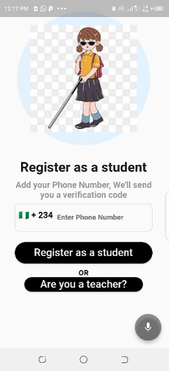
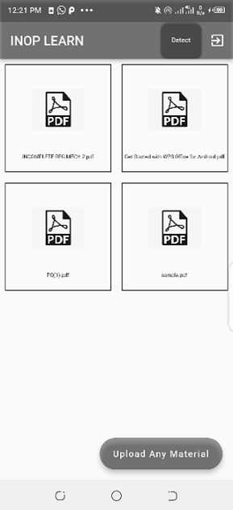

# INOP LEARN: VIsually/Partially impaired Educational and Accessibility App

Welcome to INOP LEARN, a mobile application designed to enhance the quality of education for both visually impaired, partially blind students and sighted individuals using voice assistants or conversational AI for easy navigation.

Our app aims to ease the sharing of digital materials between lecturers and students and to encourage an inclusive and well-coexisting society.

 

### Table of Content

- [Introduction](#introduction)
- [Installation](#install)
- [Features](#features)
- [Usage](#usage)
- [In-App Screens](#in-app)
- [Future Plans](#future-plans)
- [License](#license)

 

------

##  Introduction

INOP LEARN is an innovative mobile application aimed at enhancing the sharing of digital lecture materials from lecturers to students improving the connection between lecturers and students and as well as helping students staying orgainized and promoting a more inclusive community where everyone feel they belong.

### UN Sustainable Development Goals

- Goals 4 - Quality Education
- Goals 10 - Reduced Inequalities

 

## Installation

Downlad the app from playstore here 

If you wish to build codes locally, clone this repository with the command
- first, copy the link to the repository
- git clone (link to repository)
- cd/ into the directory of the cloned repository, this is the original name of the cloned repo otherwise rename by you
- open the project in your favourite editor
- In the terminal cd into the root project directory, select an android emulator and run the command
- flutter run -- this command will download all the dependencies needed for the project to work and the app should be live on your android emulator

- Testers can use this test phone number or you can use your real phone number to test the working feature of the app
  - test phone number: +234 1234567891
  - test verification code: 123456
 

## Features

1. **Sharing Of Digital Material**: Teachers can sign-up with their phone number and upload course material and student will receive notification on the materials uploaded by the teacher. Students also have the privilege to upload his/her personal material on the app.

2. **Voice Assistants**: Click on the microphone to start an interaction with the voice assistants or conversational AI on queries like 'what page is this?', 'where is the button located on the page?', 'I am new on the app and what should i do?' with all this query and many others users can navigate the app seamlessly.

3. **Listent To Material In Audio**: Once materials have been uploaded by teachers, we organize these materials with the most recent and read aloud the name of the material click by the student to allow them know which material they have open and they can listen to the material in audio form and as well adjust the speed of the audio.

3. **Stay Organize**: Users can stay organize by using the detect feature on their home page which uses their live camera and our ML model to help detect where their pen fell off or where notebook is located so they can stay organize while studying.
 

##  Usage

Our app offers two Screen for better user experience and accessibility:

1. **Teacher Screen**: Designed for visually impaired or sighted teacher, Teacher screen provides ease of use and VoiceOver support for teachers.
2. **User/Student Screen**: For visually impaired, partially blind and sighted individuals. Student screen offers a comprehensive interface to interact with the app's features and improve their overall experience.

 

##  In-App Screens

### Get Started

### Student Registration

### Student Home

### Material Screen

### Organize Screen

 

## Future Plans

1. Improve the Voice assistants or conversational AI to answer any type of query.
2. Make the app available in other languages to increase usability.
3. Collaborate with government and companies to make the app more accessible to the visually impaired community as we are already in the process of forging partnership with our university to adopt the INOP LEARN app.
4. Add a quiz feature to allow Teachers test students on the app.
5. Improve our object detection model so as to increase accuracy to about 95%.

 

### All of the source codes are available here.

- INOP LEARN APP SOURCE CODE [@nnam-droid12](https://github.com/nnam-droid12/inop-learn)

 

## License

This project is licensed under the MIT License. See the [LICENSE](https://github.com/nnam-droid12/inop-learn/blob/main/LICENSE) file for details.